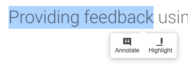
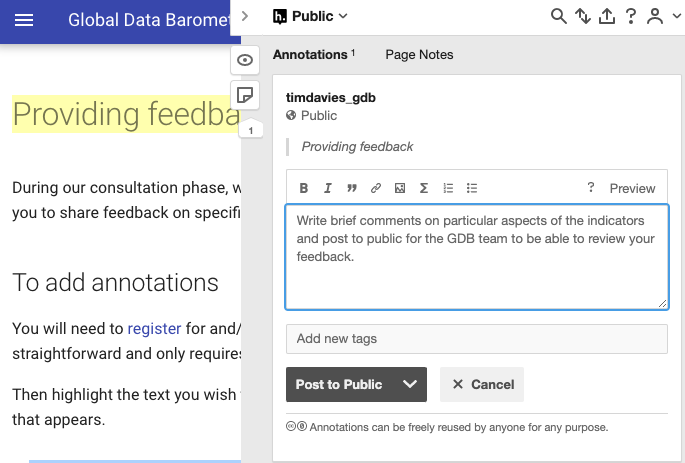

# Providing Feedback Using Annotations

During our consultation phase, we have enabled Hypothes.is on all handbook pages to allow you to share feedback on specific sections. This is similar to commenting using Google Docs - and provides comments that are visible to all viewers of the handbook.

If you prefer to provide private feedback, you can do this by e-mail, or using the comment form available on each indicator.

## To Add Annotations

You will need to [register](https://hypothes.is/signup) for and/or [log-in](https://hypothes.is/login) to a Hypothesis account. Registration is straightforward and only requires an e-mail address. 

Then highlight the text you wish to add comments on, and select 'Annotate' from the menu that appears as show in the figure below:

{ class=image_example }

This will open the annotations sidebar, where you can write your comment. 

When complete, choose 'Post to public' and your comment will be available for the Global Data Barometer team to review.

{ class=image_example }

